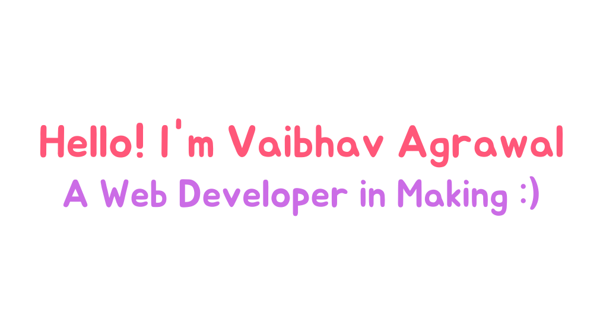

<h2 align="center"> 𝐇𝐞𝐥𝐥𝐨 𝐭𝐡𝐞𝐫𝐞, 𝐟𝐞𝐥𝐥𝐨𝐰 <𝚍𝚎𝚟𝚎𝚕𝚘𝚙𝚎𝚛𝚜/>! </h2>

  

  

### About Me 🧐 
- 🔭 I’m currently working on **Frontend Website Development**

- 🌱 I’m currently learning **Data Structures & Algorithms**

- 🤝 I’m looking for help with **Developers who can assist me on JavaScript**

- 💬 Ask me about **New Technologies , Business & Investing.**

- ⚡ Fun fact **I like cracking jokes a lot....**

<h3 align="center">Languages and Tools:</h3>

            

You have finally discovered my Github profile.  
Please feel free to clone/fork projects, raise issues and submit PRs if you think something could be better.  
Ask me anything at my social accounts...👇

### Connect with me around the web: 

<i>Happy Coding!</i> 😊

&nbsp;

 

 

 
